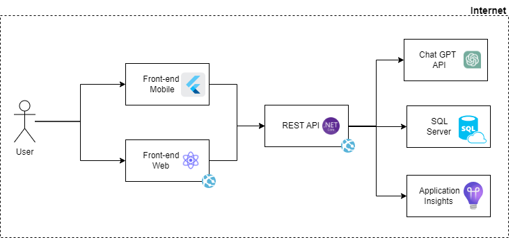

# SUMMARY

## API REST

Este projeto visa criar um backend em .NET Core 7 que permite aos usuários fazer upload de arquivos nos formatos .txt, .doc e .docx, realizar o resumo do mesmo utilizando o Chat GPT e armazenar o resumo no banco de dados (SQL). 




## Rotas:

**HTTP POST */summary***

- *Upload de Arquivos:* Os usuários podem fazer upload de arquivos nos formatos .txt, .doc e .docx.

- *Validação de Extensão:* A aplicação valida se o arquivo selecionado possui uma extensão válida (.txt, .doc ou .docx). Caso contrário, exibe uma mensagem de erro.

- *Validação de Tamanho Máximo:* A aplicação verifica o tamanho do arquivo selecionado e exibe uma mensagem de erro se o tamanho máximo for ultrapassado.

- *Realiza o resumo:* Realiza o resumo do arquivo usando Chat GPT.

- *Armazena o resumo:* Armazena o resumo no banco de dados (SQL).

- *Retorno:* Retorna o resumo inserido.

**HTTP GET */summary/latest***

1. *Retorna o resumo:* Retorna o ultimo resumo inserido no banco de dados.

## Configuração e Uso:

1. **Pré-requisitos:**
    - [Visual Studio 2022](https://visualstudio.microsoft.com/)
    - [.NET Core 7](https://dotnet.microsoft.com/download/dotnet/7.0)
    - [SonarLint For Visual Studio 2022 ](https://marketplace.visualstudio.com/items?itemName=SonarSource.SonarLintforVisualStudio2022#:~:text=Get%20Started%20with%20SonarLint,will%20start%20analyzing%20your%20issues.)
    - [SQL Server Management Studio (SSMS)](https://learn.microsoft.com/pt-br/sql/ssms/download-sql-server-management-studio-ssms?view=sql-server-ver16)
    - [Azure CLI](https://learn.microsoft.com/pt-br/cli/azure/install-azure-cli-windows?tabs=azure-cli)

2. **Clonar o Repositório:**
   ```bash
   git clone https://github.com/ignitiondti/ignition-engenharia.git
   cd seurepositorio
3. **Abrir o Projeto:**
Abra o projeto no Visual Studio 2022.

4. **Configuarar váriaveis de ambiente no launchSettings.json**

        "ASPNETCORE_ENVIRONMENT": "Development",
        "KEY_VAULT_NAME": "summary-kv"

4. **Executar a Aplicação:**
Execute a aplicação no Visual Studio pressionando F5 ou utilizando o comando *dotnet run*.

5. **Executar Testes Unitários:**
Utilize as ferramentas de testes do Visual Studio ou execute os testes unitários utilizando o comando *dotnet test*.

5. **Executar Teste de mutação:**
Acesse a parta do projeto usando PowerShell e execute o script *testeStryker.ps1*.